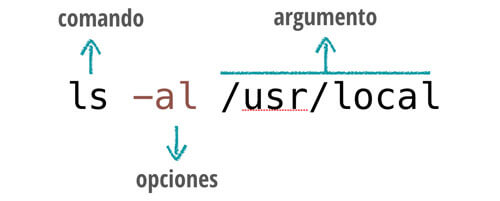

# Aprendiendo Linea de comandos Linux
Aprenderemos a cambiar ruta, crear, copiar, eliminar, carpetas y archivos a travez de la linea de comandos.

### La anatomia de un comando es la siguiente 
Todos los comandos se componen de:

* Un nombre con el que se invoca el comando.
* Opciones que modifican el comportamiento del comando. Son opcionales.
* Argumentos sobre los que actúa el comando. También opcionales.

Pero no todas las opciones son requeridos, el unico requerido solo es el comando.



### Comandos
* __help:__ Podemos encontrar ayuda de un comando escribiendo
```
help "comando"
```


* __cd:__ Cambia la carpeta de donde estamos 
```
cd /Users/germanescobar/
```

* __ls (dir en Windows):__ Lista las carpetas y los archivos.
```
ls
```

* __cat:__ Nos permite visualizar el contenido de un archivo de texto sin la necesidad de un editor.
```
cat prueba.html
```

* __mkdir:__ Crea un directorio nuevo, tomando en cuenta la ubicacion actual
```
mkdir nombre de carpeta
```

* __touch:__ Crea un archivo vacío, si el archivo existe actualiza la hora de modificación.
```
touch prueba.html
```

* __cp:__ Copia un archivo o directorio origen a un archivo o directorio destino.
```
cp /home/prueba.txt /home/respaldo/prueba.txt
```

* __mv:__  Mueve un archivo a una ruta específica, y a diferencia de cp, lo elimina del origen finalizada la operación.
```
mv /home/prueba.txt /home/respaldos/prueba2.txt
```

* __rm:__  Borra un archivo o directorio.
```
rm /home/prueba.txt
```

* __pwd:__  Imprime nuestra ubicacion actual.
```
pwd
```

* __clear:__  Limpia la terminal.
```
clear
```


## Editor VIM
El editor vim es el editor mas usado en linux y muchos programas vienen integrados con este. Listaremos algunos comandos basicos para poder manipular este editor.

El editor vim posee dos modos de operación, el modo de comandos y el modo de inserción de texto. Cuando lo inicias, entra por defecto en el modo de comandos. Para pasar al modo de editor, debes iniciarlo de alguna manera. La forma más común de pasar al modo de edición es presionando la tecla i. Para salir del modo de edición y volver al modo de comandos, basta con presionar la tecla ESC.

* __:x__ Sale del editor, salvando los cambios. Es decir, cualquier cambio que se haya efectuado en el documento, sera guardado en el disco antes de salir.

* __:q__ Sale del editor, solo si no hubieron cambios en el mismo. En caso de haber cambios, se negará a salir, dando la oportunidad de guardar los cambios realizados. Esta es la forma más segura de salir, y debe ser la que nos acostumbremos a usar.

* __:q!__ Igual que :q pero, en este caso, no guarda los cambios, ni alerta de los mismos. Util cuando hemos realizado cambios a un documento que no queremos conservar, peligroso acostumbrarse a usarlo siempre para salir, pues podemos perder los cambios realizados no habrá ningún tipo de alerta

* __:wq__
Graba el archivo y sale del editor, a diferencia de :x, :wq, graba el archivo aún cuando no se hubieran realizado cambios al mismo
