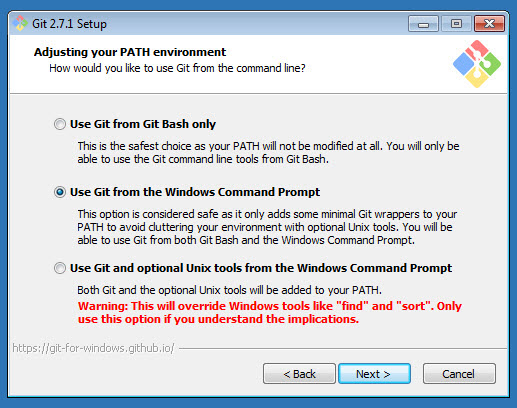

# Configurando espacio de trabajo
Empezaremos configurando nuestro espacio de trabajo para un correcto uso de nuestra computadora. Instalaremos el software necesario para poder desarrollar el codigo.
Aprenderemos comandos basicos para manejar un flujo de creacion de archivos, carpetas y edicion, tambien aprenderemos el flujo basico de git y sus comandos escenciales.

## Instalacion de software

###Editor
En el mercado existen muchos editores(brakets, sublime text, atom, etc) pero nosotros elegiremos [visual studio code](https://code.visualstudio.com/), ya que combina el poder de un [ide](https://es.wikipedia.org/wiki/Entorno_de_desarrollo_integrado) y la ligereza de un editor, tiene soporte de __intelissense__, __debuggin__, __integracion con git__ y __extenciones o plugins__. Cuenta con el respaldo de microsoft y una comunidad bastante robusta.

```
Descargar https://code.visualstudio.com/
```

### Console (para windows)
Instalaremos la consola [conEmu](https://conemu.github.io/), esta consola nos ayudara con el manejo de multiples ventanas, tambien se puede configurar el tema, para mayores caracteristicas pueden ver la [documentacion](https://conemu.github.io/).

```
Descargar https://conemu.github.io/
```

### Control de versiones
Para manejar el contro de versiones del software utilizaremos [git](https://git-scm.com/), Descargaremos el software desde [aqui](https://git-scm.com/).  Realizamos la instalacion dandole siguiente hasta el paso de la foto de abajo, donde seleccionamos la opcion 2. Esto te permitirá usar comandos de Linux y luego siguiente hasta terminar la instalacion.



### Creacion de cuenta en github
GitHub es una plataforma de desarrollo colaborativo que utiliza el contro de versiones [git](https://github.com/). Nos crearemos una cuenta desde el siguiente [enlace](https://github.com/); Todos los proyectos que hagamos estaran alojados en los repositorios de github.

### Instalando navegadores
Instalaremos los principales navegadores donde testearemos nuestras aplicaciones. Estos navegadores funcionan con los motores que se explica en esta [lista](https://es.wikipedia.org/wiki/Motor_de_renderizado). Los principales navegadores en los que trabajaremos son:
* [Google Chrome](https://www.google.com/chrome/)
* [Firefox](https://www.mozilla.org/es-ES/firefox/new/)
* [Safari](https://support.apple.com/downloads/safari-for-windows)
* [Internet Explorer 11+](https://www.microsoft.com/es-es/download/internet-explorer.aspx)

Para instalar los navegadores, solamente daremos en el boton siguiente y nos guiaremos del asistente de instalacion.

### Configurando Editor

####Terminal
Configurararemos primeramente la __terminal integrada__ de nuestro editor siguiendo el siguiente [documento](https://code.visualstudio.com/docs/editor/integrated-terminal). Referenciaremos a la consola de git para poder obtener todos los beneficios de esta.


####Plugins
Tambien instalaremos los plugins basicos para nuestro flujo de trabajo.
Encontraremos los plugins desde la barra de busqueda , buscaremos e insltaremos los siguientes:

* EditorConfig
* GitLens
* Markdown Preview


### Configurando EditorConfig
Editor config es un archivo que nos ayuda a configurar nuestro editor. Esta configuracion nos ayuda a mantener consistencia en la escritura de archivos en un equipo de muchos desarrolladores.

Crearemos la configuracion simplemente creando un archivo en la raiz con el siquiente nombre __.editorconfig__ y dentro de este agregaremos los siguiente. Si deseas obtener mas informacion ingresa a su [documentacion](https://editorconfig.org/).
 
```
root = true
[*]
end_of_line = lf
insert_final_newline = true
indent_style = space
indent_size = 2
```
